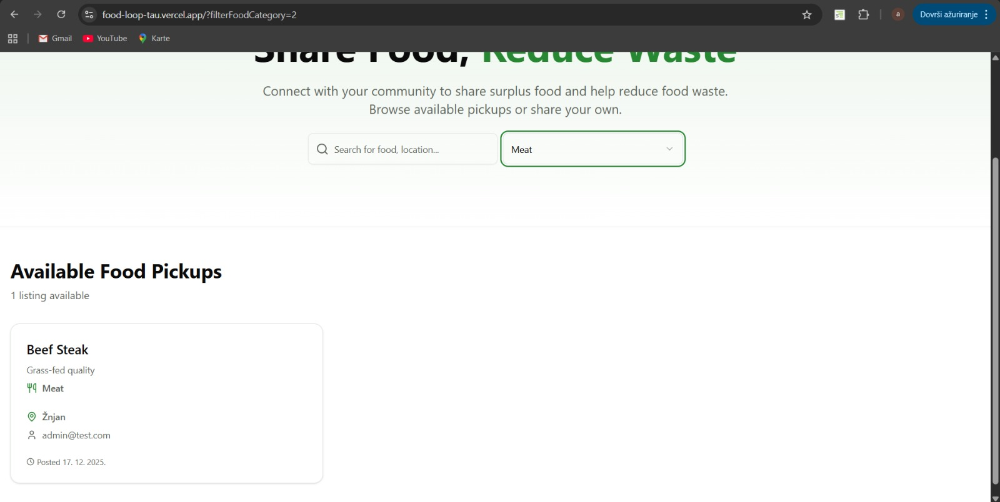
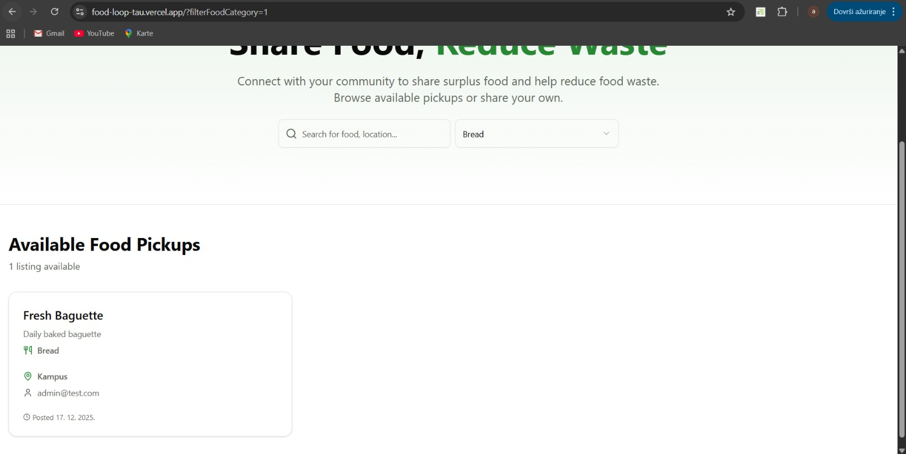

## Dynamic Routes, Filtering and Server-Side Data Fetching

This application implements dynamic routing using Next.js to display filtered list of products. Dynamic route tested to ensure correct behavior.

### Screenshots

### Live Demo

🔗 Deployed Application: https://food-loop-tau.vercel.app/?filterFoodCategory=2