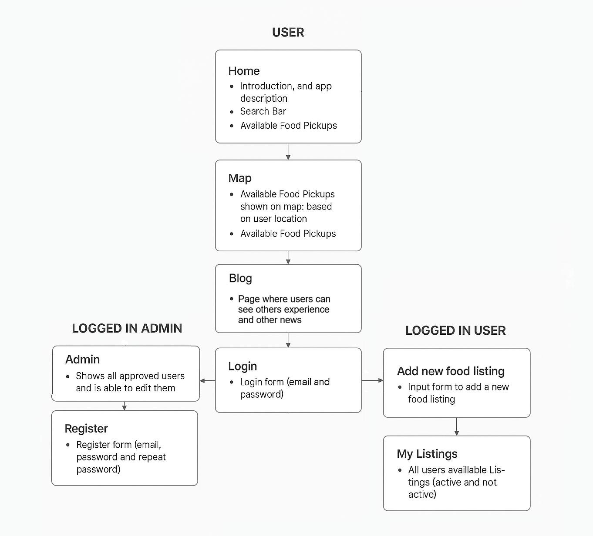
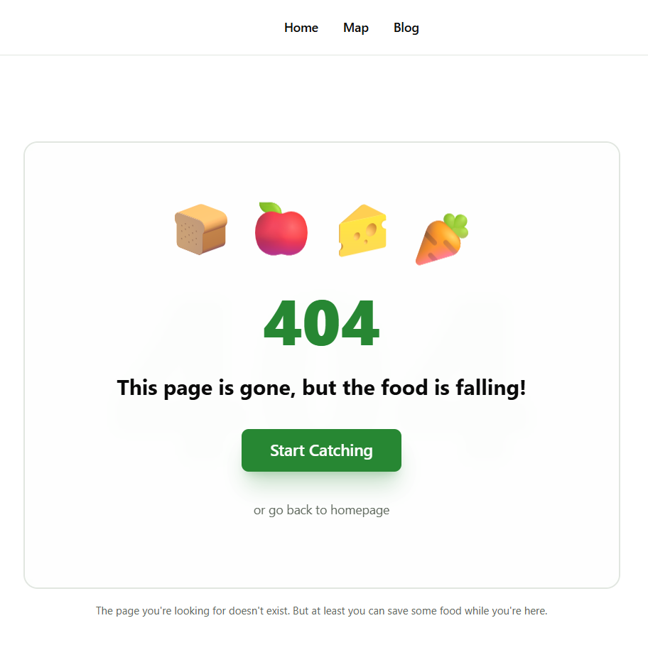
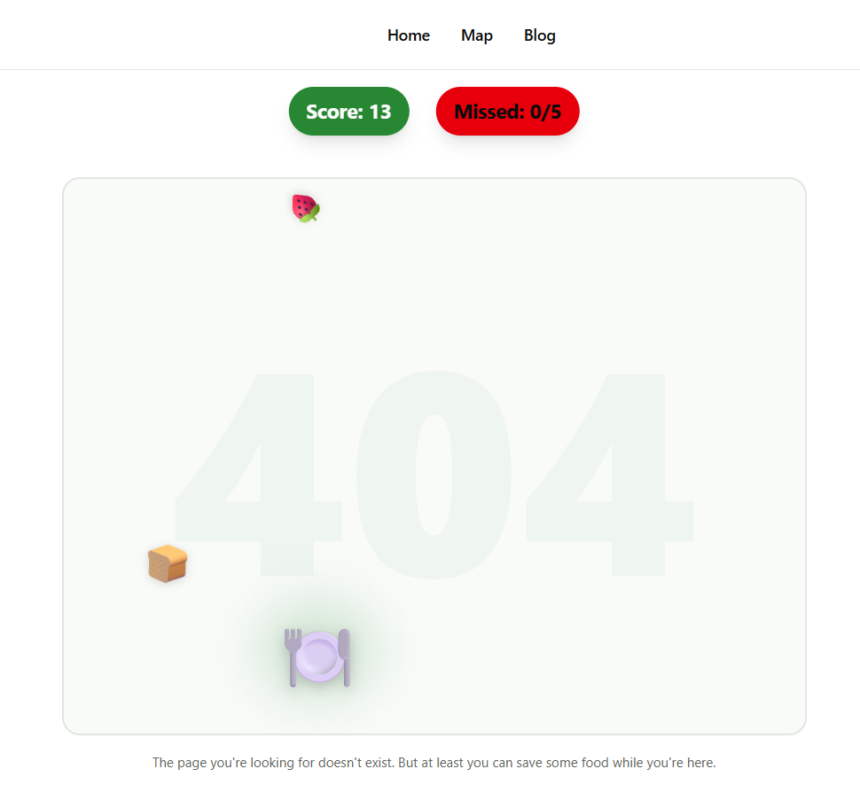

# FoodLoop – Final report

## 1. Introduction 
FoodLoop is a web application designed for sharing food within local communities. It allows users to post available food, browse listings on an interactive map, and for admins to manage users and listings. The main goal of FoodLoop is to simplify the process of sharing and discovering food in a user-friendly way. 

**Live Application:** [food-loop-tau.vercel.app](https://food-loop-tau.vercel.app/)

**Repository:** [GitHub](https://github.com/tonizulim/FoodLoop) 

## 2. Project Goals
* Provide an intuitive and easy-to-use platform for sharing food. 
* Develop an interactive user interface following HCI principles. 
* Complete all semester assignments and integrate them into the project. 
* Explore some experimental features that may or may not be totally useful, but hey, why not? 
## 3. Technologies and Tools 
* **Frontend:** Next.js 14 (App Router), TypeScript, Tailwind CSS + shadcn/ui. 
* **Authentication:** Better Auth. 
* **Backend/Storage:** Supabase, PostgreSQL, Drizzle ORM. * **Other Tools:** VSCode for coding, Figma for wireframes, and occasionally staring at the wall for inspiration. 
## 4. Development Process 
1. **Define the problem:**
* Explain problem 
* Who are target users
* What is the solution
2. **Define user personas:** 
* Define users and user roles
* Define what every user can do
3. **Create main web page:**
* Create base webpage from where you can expand your page
4. **Create page prototype:**
*  Using figma we have created base design for out web app
5. **Dynamic Routes and filtering:**
*  Enable user to filter products using dynamic routes
6. **Login and registration:**
* Allow users to register and login to your page so they can post their food on page

You can read more about each step from above on next link:
[**Assignments**](https://github.com/tonizulim/FoodLoop/blob/main/assignments/)

## 5. Site Map

## 6. Google PageSpeed Insights

This page achieved a 100/100 score on Google PageSpeed Insights, indicating excellent performance across both mobile and desktop devices. All Core Web Vitals are within the “Good” range, including Largest Contentful Paint (LCP), First Input Delay (FID), and Cumulative Layout Shift (CLS). The page loads quickly, responds smoothly to user interactions, and maintains visual stability throughout the loading process. more on [link](https://pagespeed.web.dev/analysis/https-food-loop-tau-vercel-app/i1ytmu3nej?form_factor=mobile)

## 7. Usability Evaluation
The evaluation was conducted using a heuristic approach to reviewing the interface and functionality, including:

✔️ Information structure

✔️ Navigation elements

✔️ Clear feedback during user actions

✔️ Aesthetics and minimalism

✔️ Controls and data input interface

✔️ Responsiveness

It is based on well-known usability evaluation principles, including those described in the usability evaluation literature.

**1. Visibility of System Status:**

In every moment user can see in what state he is example of that is darker background of a page button that he is currently on:

also if there isn't any food available for the specific  at the moment user can see message "No listings match your search."

also by using loading skeletons 

**2. Match Between System and the Real World:**

The terminology is clear. Icons and categories are meaningful (e.g., searching by type of food). The connection between the search concept and the displayed cards is immediate and logical.

**3. User Control and Freedom:**

The user can easily return to the initial state or state before. For example, on main page user can return to initial state by clearing the search field using "reset" button, or from specific blog post using "<- back to blog" button

**4. . Consistency and Standards:**

This consistency reduces the learning curve, as users can rely on familiar interaction models when searching and filtering content. By adhering to widely accepted design standards, the interface behaves in a predictable way, allowing users to focus on their goals rather than on understanding how the system works. Example of this is the placement of the search bar and filters at the top of the page follows established web design patterns that users recognize from platforms such as Airbnb and similar listing or catalog-based websites.

**5. Error Prevention and Recovery:**

When a user enters a search term that does not exist, the application does not crash or display an empty screen. Instead, it provides a clear message indicating that the search was unsuccessful.
This behavior helps prevent user confusion and reassures users that the system is functioning correctly, even when no results are found.
This is shown on main page where user can see message "No listings match your search" and he can reset search query with "reset search button"

**6. Recognition Rather Than Recall:**

Categories are visually highlighted, making it easy for users to see all available options at a glance. Users do not need to memorize food groups or filter options; they can simply select from the clearly presented list. Additionally, URL parameters preserve the selected filters, so even if the page is refreshed or revisited, the user’s choices remain visible and active.

This design minimizes cognitive load by relying on recognition instead of recall, which aligns with one of Nielsen’s key usability heuristics. Users can focus on their tasks (e.g., finding a specific type of food) rather than remembering previous actions or inputs, resulting in a smoother and more intuitive experience.

**7. Flexibility and Efficiency of Use:**

he system accommodates both novice and experienced users. URL-based searching allows power users to bookmark specific filtered views, enabling quick access to frequently used searches without repeating steps. Additionally, the interface responds instantly to parameter changes, allowing users to adjust filters and see updated results immediately.

These features enhance efficiency by reducing repetitive actions and providing shortcuts for advanced users, while still keeping the system intuitive for everyone.

**8. Aesthetic and Minimalist Design:**

The user interface is clean and modern, with ample white space that enhances readability and reduces visual clutter. The search bar and filters are unobtrusive, allowing users to focus on the content without distractions.

By prioritizing essential elements and minimizing unnecessary information, the design supports a smooth and pleasant user experience, making it easy for users to navigate and find content quickly.

**9. Error Handling & the “Joy of Failure” (404 Page):**

The application features a custom 404 error page that includes an interactive game, similar to Chrome’s “Dino Run.”

Principle Applied: Emotional Design & Gamification. Instead of showing a standard, technical error message, the app provides a playful “productive distraction” that keeps users engaged even when they encounter a broken link.

UX Impact:

Retention: Users remain on the site longer, reducing the likelihood of leaving due to a dead-end page.

Brand Loyalty: Memorable “Easter eggs” like this create a positive and lasting impression, contributing to an enjoyable and distinctive user experience.

## 8. Conclusion 
FoodLoop demonstrates the application of HCI principles in a real-world web project. Modular design, modern technologies, and focus on user experience make the application functional and easy to use. Future improvements could include gamification, AI-powered food suggestions, and more interactive maps, just for fun.